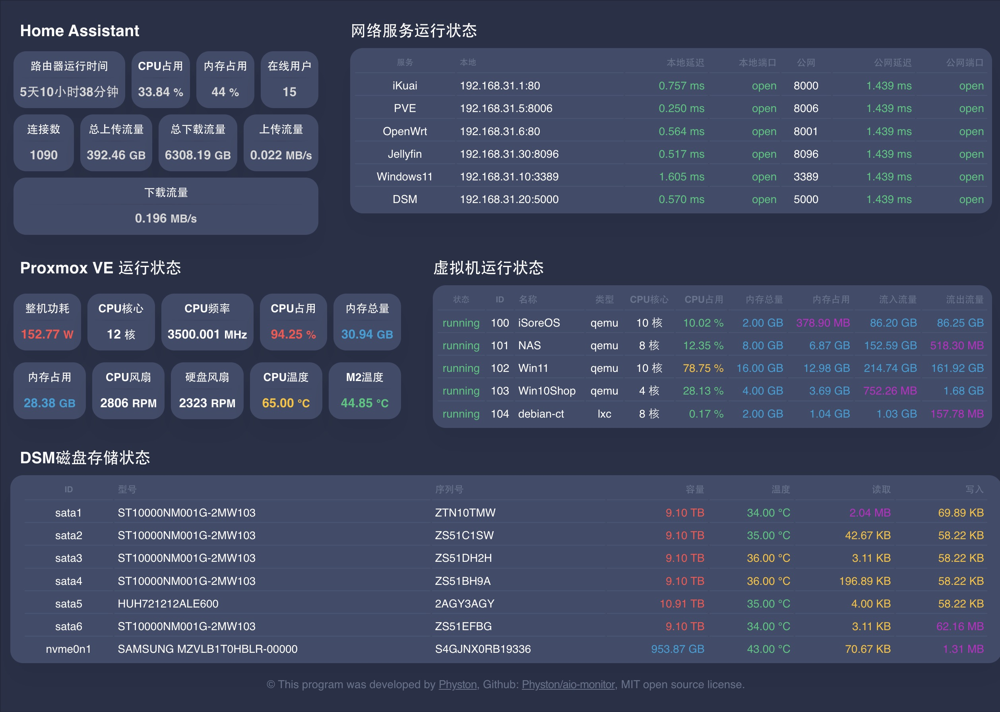
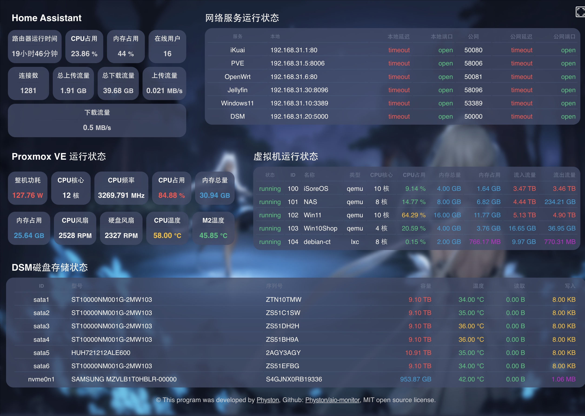
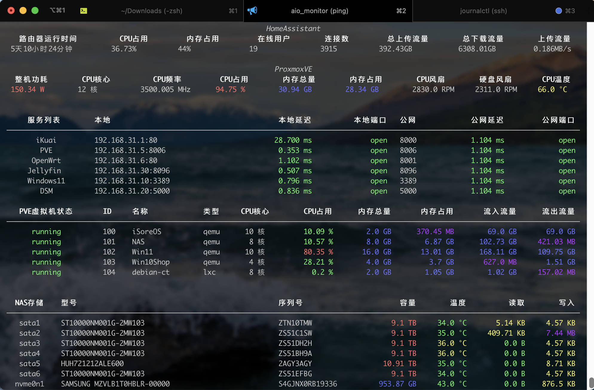

# AIO-Monitor

[](https://github.com/Physton/aio-monitor/stargazers)
[](https://github.com/Physton/aio-monitor/network/members)
[](https://github.com/Physton/aio-monitor/issues)
[](https://github.com/Physton/aio-monitor/issues?q=is%3Aissue+is%3Aclosed)
[](https://github.com/Physton/aio-monitor/blob/master/LICENSE.md)
[](https://github.com/Physton/aio-monitor/commits/main)
[](https://github.com/Physton/aio-monitor/releases)
[](https://github.com/Physton/aio-monitor/releases)
[](https://hub.docker.com/r/physton/aio-monitor)
[](https://hub.docker.com/r/physton/aio-monitor/stargazers)

个人家用 All-in-one ProxmoxVE 服务器的监视面板。终端实时监视 + WEB网页实时监视。

## 主要功能：
1. 读取 [Home Assistant](https://www.home-assistant.io/) 中物联网产品传感器值（需要展示什么传感器可以完全自定义）。
2. 自定义网络服务，监控IP及端口实时响应状态。
3. 监视 [Proxmox VE](https://www.proxmox.com/en/proxmox-virtual-environment/overview) CPU、内存、风扇、温度等信息。
4. 监视 [Proxmox VE](https://www.proxmox.com/en/proxmox-virtual-environment/overview) 虚拟机状态。
5. 监视 DSM 中磁盘状态。

## Demo
- WEB

- WEB带背景

- 终端


## ⚠️⚠️⚠️注意事项
1. Proxmox VE 服务器需要安装 `sensors`，用于读取传感器信息。
    > `apt install lm-sensors`
2. DSM 系统需要关闭双重认证。

## 通过 Docker 运行

### 配置

1. 建立 `aio-monitor` 文件夹，或者其它任意名称。
2. 将项目中的 [config.example.yaml](https://raw.githubusercontent.com/Physton/aio-monitor/main/config.example.yaml) 复制进 `aio-monitor` 文件夹并重命名为 `config.yaml`。
3. 根据 `config.yaml` 文件中的注释说明，手动修改内容。
4. 在 `aio-monitor` 文件夹中创建 `logs` 文件夹。

### 运行
- 方式一：使用命令行运行
    ```bash
    docker run -d \
    -p 8000:8000 \
    -v ./config.yaml:/app/config.yaml \
    -v ./logs:/app/logs \
    --name aio-monitor \
    physton/aio-monitor
    ```
- 方式二：使用 docker-compose 运行
    1. 新建 `docker-compose.yml` 文件
        ```yaml
        version: '3.7'
        services:
          aio-monitor:
            image: physton/aio-monitor
            container_name: aio-monitor
            restart: always
            ports:
              - 8000:8000
            volumes:
              - ./config.yaml:/app/config.yaml
              - ./logs:/app/logs
        ```
    2. 启动
        ```bash
        docker-compose up -d
        ```

### 访问
[http://localhost:8000](http://localhost:8000)

## 手动运行

> ⚠️⚠️⚠️注意：本程序在 Macos 下开发测试，未在 Windows 平台下运行并测试，无法保证 Windows 下正常运行。

1. 安装 [python](https://www.python.org/downloads/) 3.9+
    > 请自行搜索安装教程，并将 python 添加到环境变量
2. 下载本项目到本地。
    - 方式一：使用 git clone 下载（你的电脑上需要安装 git）
        ```bash
        git clone https://github.com/Physton/aio-monitor.git
        ```
    - 方式二：手动下载：[aio-monitor.zip](https://github.com/Physton/aio-monitor/releases/latest/download/aio-monitor.zip) 并解压。
3. 将项目中的 [config.example.yaml](https://raw.githubusercontent.com/Physton/aio-monitor/main/config.example.yaml) 重命名为 `config.yaml`，根据文件中的注释说明，手动修改内容。
4. 打开系统命令行（终端），进入本项目目录
    ```bash
    cd aio-monitor
    ```
5. 安装依赖
    ```bash
    pip3 install -r requirements.txt
    ```
    > 如果你是中国大陆用户，可能因为网络原因无法正常安装依赖，可使用以下命令尝试。
    > ```bash
    > pip install -r requirements.txt -i https://pypi.mirrors.ustc.edu.cn/simple
    > ```

6. 运行
    ```bash
    python main.py -W -S
    ```
    详细的启动参数，请参考：[启动参数](README.MD#启动参数)
7. 访问 [http://localhost:8000](http://localhost:8000)

## 启动参数
| 参数名 | 完整名称 | 默认值 | 说明 |
| ---- |----| ---- | ---- |
| -W | --web | False | 启动WEB服务，通过浏览器访问查看信息 |
| -S | --shell | False  | 通过 shell 输出信息 |
| -C | --config | config.yaml | 配置文件路径，默认为当前程序目录中的 config.yaml |
| -L | --logs | logs | 日志保存路径，默认为当前程序的 logs 目录 |
| -h | --help | | 显示帮助 |
| -V | --version | | 显示版本号 |

## 配置文件说明

| 参数 | 类型 | 说明 | 示例 |
| ---- |----| ---- | ---- |
| app_host | 文本 | WEB服务监听IP。`0.0.0.0` 代表监听本机所有IP地址。如果为 `127.0.0.1` 代表只监听 `127.0.0.1` 地址 | 0.0.0.0 |
| app_port | 数字 | WEB服务监听端口，请确保没有与其他程序端口冲突 | 8000 |
| app_secret | 文本 | 加密密钥，随机字符串 | 1jsgN581Q8wtUfkcc6eZDinxP5olTPC4 |
| app_expire | 数字 | 登陆会话过期时间，单位秒 | 3600 |
| app_username | 文本 | 登陆用户名，如果用户名为空，则代表不需要登陆即可查看网页 | admin |
| app_password | 文本 | 登陆密码，如果密码为空，则代表不需要登陆即可查看网页 | 123456 |
| app_background_image | 文本 | 网页背景，相对于 html 目录下的路径。也可以是网络图片地址。为空则无背景图片 | https://pic3.zhimg.com/v2-f9e2540b840f54ab8a0d6e0150d770e2_r.jpg |
| app_background_blur | 数字 | 背景模糊度，值越大越模糊，为空或者0为不模糊 | 2 |
| app_card_background_color | 文本 | 网页卡片背景颜色，可以为 rgb、rgba、十六进制等CSS颜色。这里的演示中的0.8代表80%透明度。如果为1，则代表不透明 | rgba(64, 75, 105, 0.8) |
| addresses | 数组 | 监听服务列表 | |
| addresses[].name | 文本 | 服务名称 | iKuai |
| addresses[].local | 文本 | 本地IP/域名 | 192.168.31.1 |
| addresses[].local_port | 数字 | 本地端口 | 80 |
| addresses[].public | 数字 | 公网/IP域名 | example.com |
| addresses[].public_port | 文本 | 公网端口 | 8000 |
| pve_web | 字典 | Proxmox VE 服务器信息。用于通过 api 的方式，读取CPU、内存信息、使用率信息、虚拟机列表 | |
| pve_web.host | 文本 | IP/域名 | 127.0.0.1 |
| pve_web.port | 数字 | 网页端口 | 8006 |
| pve_web.username | 文本 | 用户名，注意用户名后面要加上@领域，例如 @pam | root@pam |
| pve_web.password | 文本 | 密码 | 123456 |
| pve_ssh | 字典 | Proxmox VE SSH 信息。用于通过 ssh 的方式，执行命令，读取cpu风扇转速、磁盘风扇转速、温度等信息。 | |
| pve_ssh.host | 文本 | IP/域名 | 127.0.0.1 |
| pve_ssh.port | 数字 | SSH端口 | 22 |
| pve_ssh.username | 文本 | 用户名 | root |
| pve_ssh.password | 文本 | 密码 | 123456 |
| pve_ssh.disk_fan | 文本 | 磁盘风扇转速传感器。进入 pve ssh，执行命令 sensors -j，取实际的键名。子节点用英文句号分隔 | nct6798-isa-0a20.fan1.fan1_input |
| pve_ssh.cpu_fan | 文本 | CPU风扇转速传感器。进入 pve ssh，执行命令 sensors -j，取实际的键名。子节点用英文句号分隔 | nct6798-isa-0a20.fan2.fan2_input |
| pve_ssh.cpu_temp | 文本 | CPU温度传感器。进入 pve ssh，执行命令 sensors -j，取实际的键名。子节点用英文句号分隔 | coretemp-isa-0000.Package id 0.temp1_input |
| pve_ssh.nvme_temp | 文本 | M2温度传感器。进入 pve ssh，执行命令 `sensors -j`，取实际的键名。子节点用英文句号分隔 | nvme-pci-0300.Composite.temp1_input |
| dsm | 字典 | DSM系统信息。用于通过 api 的方式，读取存储设备列表 | |
| dsm.host | 文本 | IP/域名 | 127.0.0.1 |
| dsm.port | 数字 | 端口 | 5000 |
| dsm.username | 文本 | 用户名 | username |
| dsm.password | 文本 | 密码 | 123456 |
| homeassistant | 字典 | Home Assistant 信息。用于通过 api 的方式，读取传感器值。 | |
| homeassistant.address | 文本 | 网址 | http://example.com:8123 |
| homeassistant.token | 文本 | API 令牌。个人头像 -> 长期访问令牌 -> 创建令牌 | xxxxxx |
| homeassistant.pve_power_sensor_id | 文本 | 指定 PVE 机器智能插座的传感器，获取 PVE 所属物理机的总功耗 | sensor.chuangmi_212a01_67ff_electric_power |
| homeassistant.sensors | 数组 | 自定义 Home Assistant 传感器列表 | |
| homeassistant.sensors[].title | 文本 | 传感器显示标题 | 路由器运行时间 |
| homeassistant.sensors[].id | 文本 | 传感器ID。配置 -> 设备与服务 -> 实体注册表 -> 实体ID | sensor.ikuai_uptime |

### 请我喝杯咖啡

| Buy me a coffee (EN) | [](https://buymeacoffee.com/physton) |
|:-----------:| :----: |
| ko-fi (EN) | [](https://ko-fi.com/physton) |
| Paypal (EN) | [https://paypal.me/physton](https://paypal.me/physton) |
| 爱发电 (CN) | [https://afdian.net/a/physton/thank](https://afdian.net/a/physton/thank) |
| 支付宝 (CN) |  |
| 微信赞赏 (CN) |  |